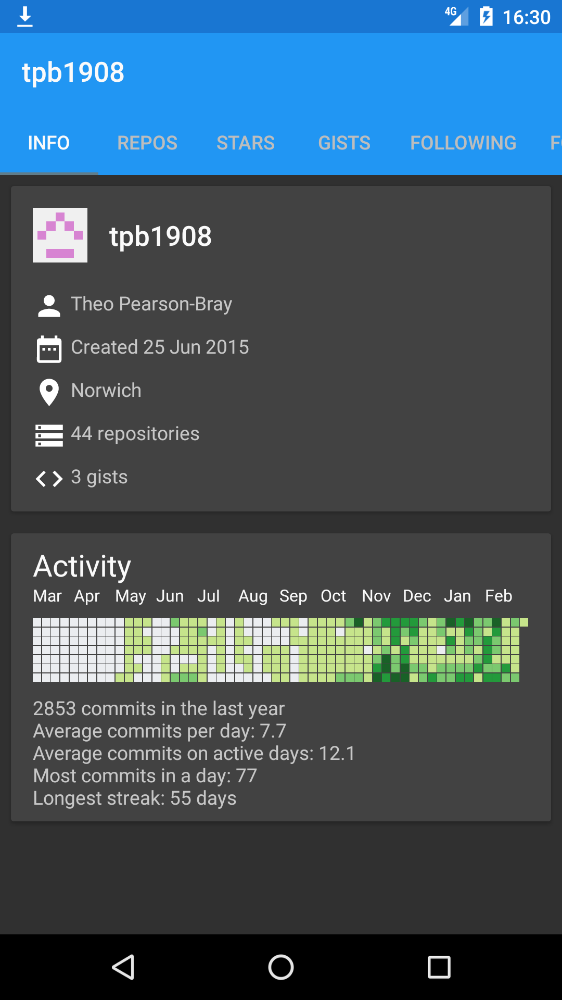
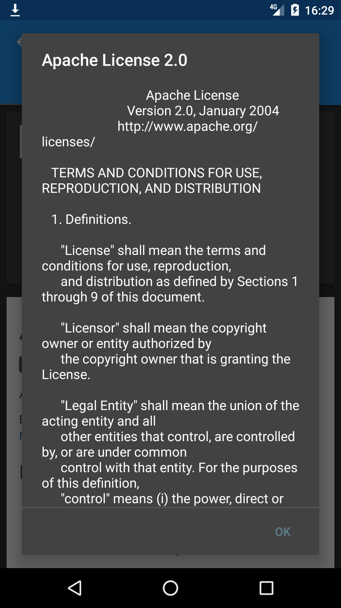
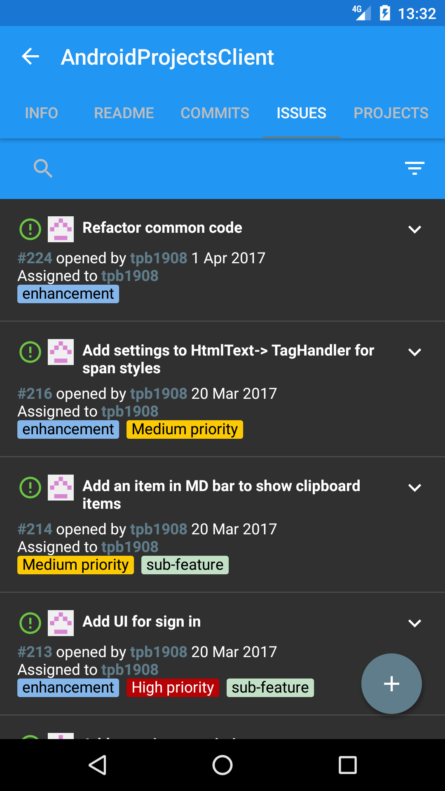
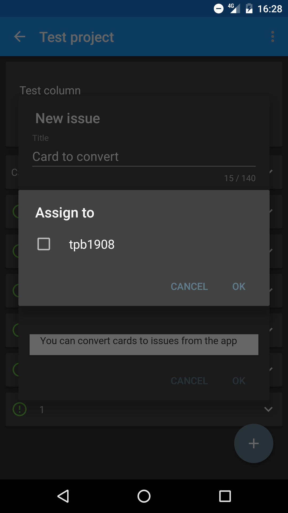

# AndroidProjectsClient  [](https://travis-ci.org/tpb1908/AndroidProjectsClient)

An Android client for [GitHub projects](https://github.com/blog/2256-a-whole-new-github-universe-announcing-new-tools-forums-and-features).

Built using [the official GitHub API](https://developer.github.com/v3/projects/) and [Fast-Android-Networking](https://github.com/amitshekhariitbhu/Fast-Android-Networking).

### Dependencies

* [ButterKnife](https://github.com/JakeWharton/butterknife)

* [OkHttp](https://github.com/square/okhttp)

* [Fast-Android-Networking](https://github.com/amitshekhariitbhu/Fast-Android-Networking)

* [Clans FloatingActionButton](https://github.com/Clans/FloatingActionButton) Modified

* [CommonMark-Java](https://github.com/atlassian/commonmark-java)

* [HtmlTextView](https://github.com/SufficientlySecure/html-textview) Modified

* [CWAC Pager](https://github.com/commonsguy/cwac-pager)

* [AOSP support library](https://developer.android.com/tools/support-library/features.html)

* [Google Services](https://developers.google.com/android/guides/setup)

* [FireBase core and crash](https://firebase.google.com/docs/android/setup)

* [Leak Canary](https://github.com/square/leakcanary)


### Features

* Fill something in here, the list before looked ridiculous

### Upcoming features (In order of precedence)

* Sharing (Of columns and cards)
* Adding milestone when creating issue, and editing milestones when editing issues
* Creating/Editing labels for a repository
* Extra column in project to display all issues, and allow creating cards from them
* Moving of columns between projects
* Moving of cards between projects
* Backup and restore
* Cache of changes
* Offline storage
* Notification service for new cards, issues etc

### Setup

**Clone of fork the repository**


**Register a new application on GitHub**

* Go to https://github.com/settings/developers

* Add you application name and callback url

* Add the client ID and secret to gradle.properties

```
GITHUB_CLIENT_ID="GITHUB_ID"

GITHUB_CLIENT_SECRET="GITHUB_SECRET"
```

**Register a new application on Imgur**

This is not essential, but in app image uploading will not work otherwise

```
IMGUR_CLIENT_ID="IMGUR_ID"

IMGUR_CLIENT_SECRET="IMGUR_SECRET"

```

**Add your information to gradle.properties**

```
REPO_ADDRESS="Address of your fork"
GITHUB_REDIRECT_URL="Your redirect url"
FEATURE_REQUEST_EMAIL="Your email"
BUG_EMAIL="Your email"
```

**Setup or remove analytics**

If you want to use FireBase analytics and crash reporting you need to register and add your google-services.json

The setup process can be completed through Android Studios' helper under tools -> FireBase.


### Screenshots

| Context | Screenshot  |
| --- | --- |
| User |   |
| Repos |  |
| Repo |   |
| License |  |
| Issues |  |
| Assignment |  |
| Issue |  |
| Project |  |
| Editing |  |

### License

    Copyright 2016 Theo Pearson-Bray

    Licensed under the Apache License, Version 2.0 (the "License");
    you may not use this file except in compliance with the License.
    You may obtain a copy of the License at

    http://www.apache.org/licenses/LICENSE-2.0

    Unless required by applicable law or agreed to in writing, software
    distributed under the License is distributed on an "AS IS" BASIS,
    WITHOUT WARRANTIES OR CONDITIONS OF ANY KIND, either express or implied.
    See the License for the specific language governing permissions and
    limitations under the License.

