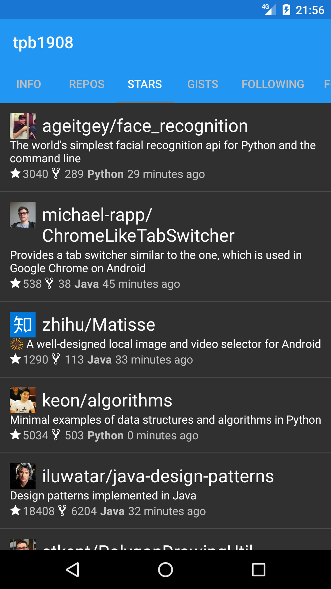
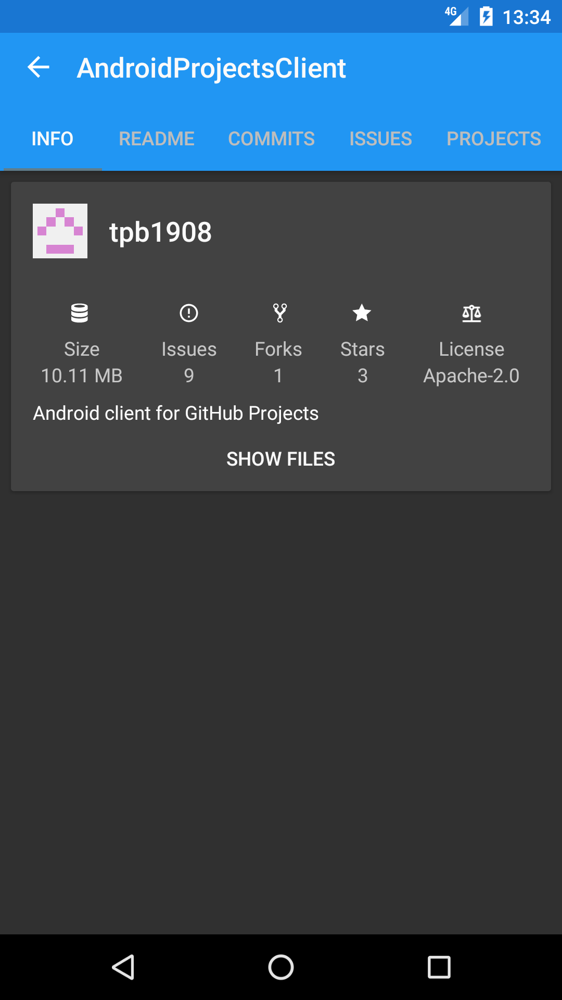
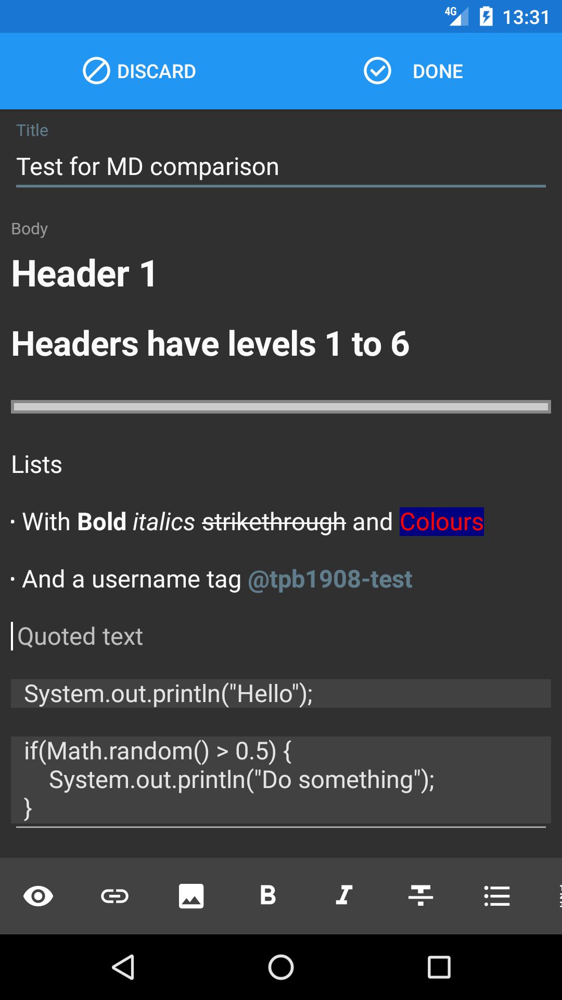

# AndroidProjectsClient

An Android client for [GitHub projects](https://github.com/blog/2256-a-whole-new-github-universe-announcing-new-tools-forums-and-features).

Built using [the official GitHub API](https://developer.github.com/v3/projects/) and [Fast-Android-Networking](https://github.com/amitshekhariitbhu/Fast-Android-Networking).

###Dependencies

* [ButterKnife](https://github.com/JakeWharton/butterknife)

* [OkHttp](https://github.com/square/okhttp)

* [Fast-Android-Networking](https://github.com/amitshekhariitbhu/Fast-Android-Networking)

* [Android-Iconics](https://github.com/mikepenz/Android-Iconics)

* [Clans FloatingActionButton](https://github.com/Clans/FloatingActionButton)

* [CWAC AndDown](https://github.com/commonsguy/cwac-anddown)

* [HtmlTextView](https://github.com/SufficientlySecure/html-textview)

* [MarkedView](https://github.com/mittsuu/MarkedView-for-Android)

* [CWAC Pager](https://github.com/commonsguy/cwac-pager)

* [AOSP support library](https://developer.android.com/tools/support-library/features.html)


###Setup

**Clone of fork the repository**


**Register a new application on GitHub**

* Go to https://github.com/settings/developers

* Add you application name and callback url

* Add the client ID and secret to gradle.properties

```
GITHUB_CLIENT_ID="ID"

GITHUB_CLIENT_SECRET="SECRET"
```


**Setup or remove analytics**

If you want to use FireBase analytics and crash reporting you need to register and add your google-services.json

The setup process can be completed through Android Studios' helper under tools -> FireBase.


### Screenshots




<br />


